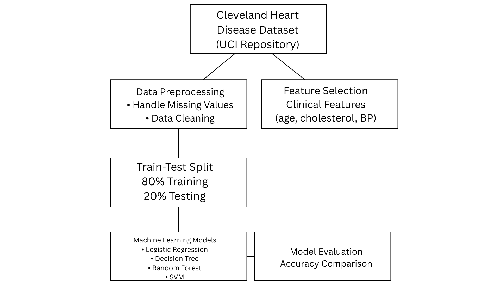
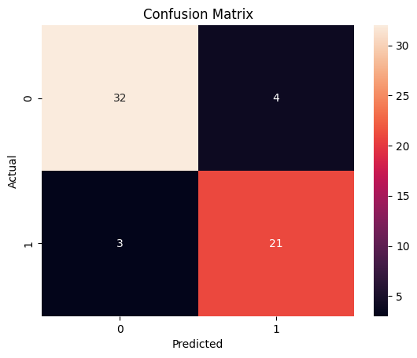
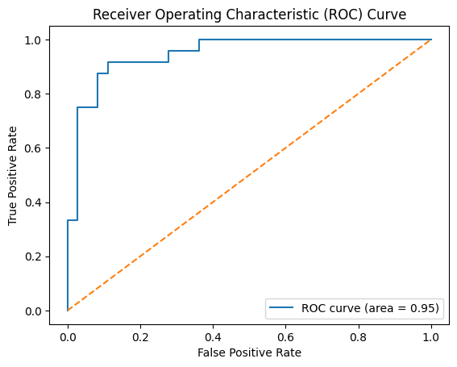

# Heart Disease Prediction using Machine Learning

This project performs a comparative analysis of machine learning algorithms for predicting heart disease using the Cleveland Heart Disease dataset.

## Algorithms Used
- Logistic Regression
- Decision Tree
- Random Forest
- Support Vector Machine

## Dataset
Cleveland Heart Disease Dataset  
UCI Machine Learning Repository

## Evaluation Metrics
- Accuracy
- Precision
- Recall
- F1-score
- Confusion Matrix
- ROC Curve

## Results
Random Forest and Logistic Regression achieved the highest accuracy of **88.33%**.

## Visualizations
- Accuracy comparison graph
- Confusion matrix
- ROC curve
- Workflow diagram

## Tools Used
- Python
- Scikit-learn
- NumPy
- Pandas
- Matplotlib
- Seaborn
- Google Colab

## Research Paper
IEEE-style research paper included in this repository.

## Model Workflow

## Confusion Matrix

## ROC Curve

[]
(https://github.com/namanj543/heart-disease-prediction-ml/blob/main/heart_disease_prediction.ipynb)

## Project Structure

- heart_disease_prediction.ipynb : Machine learning model notebook
- heart.csv : Cleveland Heart Disease dataset
- workflow.png : System workflow diagram
- confusion_matrix.png : Model evaluation
- roc_curve.png : ROC curve of classifier
- heart_disease_ml_research_paper.pdf : Research paper

Author: Naman Jain
